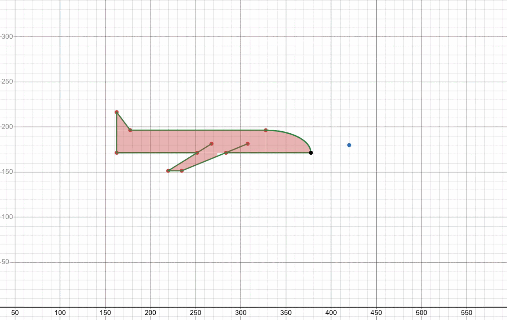
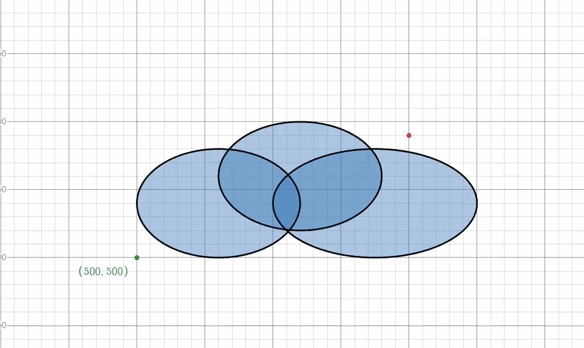

# Java G2D Plane Game (Jogo Avião)

Um jogo desenvolvido em Java 2D onde você controla um avião. O objetivo é soltar "presentes" para pintar os prédios de vermelho e acumular pontos, enquanto desvia das nuvens e dos próprios prédios para não perder.


https://github.com/user-attachments/assets/d4391bf7-a22a-4ba4-9f53-a01d2d1510e1


## Como compilar e rodar o projeto

Este projeto requer o [Java JDK](https://www.oracle.com/java/technologies/downloads/) (versão 22 definida no projeto) e o [Apache Maven](https://maven.apache.org/) instalados.

Para compilar e gerar o arquivo executável associado ao projeto, abra o terminal no diretório raiz e execute:
```bash
mvn clean package
```

Após a compilação, para iniciar o jogo utilizando o `.jar` gerado na pasta `target`, execute:
```bash
java -jar target/JogoAviao-1.0-SNAPSHOT.jar
```

*Se preferir apenas rodar diretamente pelo Maven, use:*
```bash
mvn compile exec:java
```

## Controles do jogo

- **Seta para Cima (↑)**: Mover o avião para cima
- **Seta para Baixo (↓)**: Mover o avião para baixo
- **Seta para Esquerda (←)**: Mover o avião para a esquerda
- **Seta para Direita (→)**: Mover o avião para a direita
- **Espaço (Space)**: Atirar (soltar o presente)
- **Esc**: Fechar o jogo e sair

## Modelagem das Hitboxes

A modelagem matemática (bounding box) para a verificação das hitboxes no jogo foi construída utilizando o software **Desmos**. Abaixo estão as representações visuais desse desenvolvimento.

### Hitbox do Avião
O contorno matemático do avião foi projetado considerando as asas, seu corpo e o seu cockpit semielíptico, garantindo uma colisão mais precisa e justa.



🔗 [Visualizar Gráfico Interativo - Hitbox do Avião (Desmos)](https://www.desmos.com/calculator/73ee288e84?lang=pt-BR)

### Hitbox da Nuvem
As nuvens foram modeladas unindo equações de elipses para delimitar sua área e computar as colisões com o avião.



🔗 [Visualizar Gráfico Interativo - Hitbox da Nuvem (Desmos)](https://www.desmos.com/calculator/827281d669?lang=pt-BR)

## Detalhes Técnicos

Durante o desenvolvimento deste projeto, foram aplicadas otimizações importantes para melhorar a performance geral e estabilidade gráfica do jogo:

- **Two Buffered Animation**: Foi implementada a técnica de "two buffered animation", responsável por desenhar a tela fora de vista (em segundo plano) para depois renderizá-la. Isso se fez necessário já que o Java 2D Graphics não contém isso por padrão. Assim, eliminamos o efeito visual de flickering durante a atualização da tela a cada frame.

- **Sistema de Object Pooling**: Constantemente vemos **nuvens**, **prédios** e **presentes** sendo gerados e saindo da perspectiva da tela. Em vez de ficar criando-os em memória e destruindo-os de maneira contínua, optou-se por utilizar o sistema de pooling. Com isso, o jogo reaproveita e reutiliza objetos já instanciados reciclando sua aparição. Essa otimização de alocação de memória previne que o Garbage Collector do Java reduza o framerate no meio da partida.
